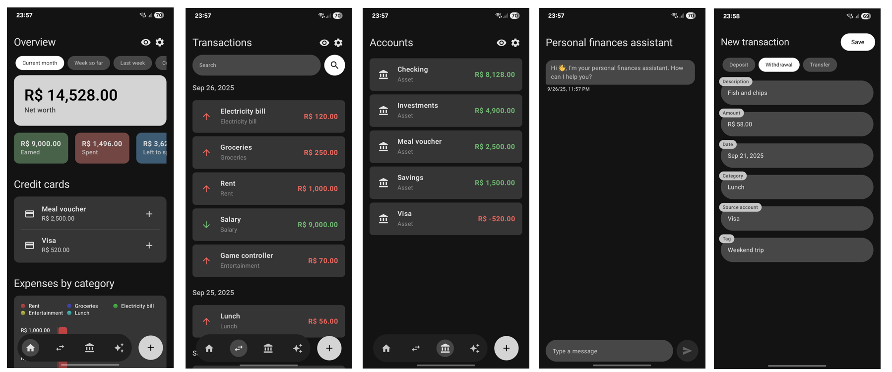

<h1 align="center">
    Firefly Companion
</h1>

    

An unofficial Android companion app for Firefly III — the open‑source, self‑hosted personal finance manager.
This project aims to provide an intuitive, mobile‑first experience to browse your balances, accounts, and transactions,
perform common actions on the go, gain insights from an integrated AI‑powered personal finance assistant, and more.

Please note that this project is highly opinionated and is intended as an on‑the‑go companion for quick actions.
Not all Firefly III features will be available by design.

To get started, check the Releases page and download the APK file. The app will guide you through connecting to your
Firefly III server and getting started.

For now, suggestions, issues, and pull requests will not be accepted, but feel free to fork the repository and modify
the app to best fit your needs.
